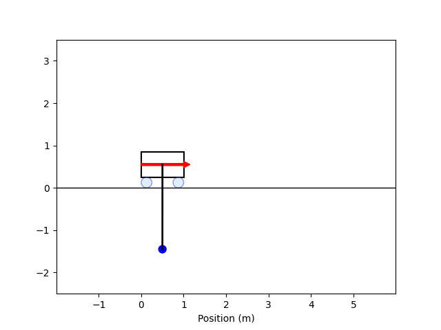

# PACE modelling & control Python code

This repository contains some example scripts detailing how to model and simulate simple systems in Python.

| Pendulum              | Cart               |
| ---------------------- | ---------------------- |
|  |  |

## Requirements
- Windows
- Python 3.8+ (recommended)
- `venv` (comes with Python)

## Setup Instructions

1. **Copy this in a command prompt to clone the repository**
    ```bash
    git clone https://github.com/sherschm/PACE_repository.git
    cd PACE_repository
    python -m venv venv 
    ```

2. **Activate the Python virtual environment**

In a command prompt run:

```shell
venv\Scripts\activate.bat
```

3. **Install the required Python dependencies**
```shell
pip install --upgrade pip
pip install -r requirements.txt
```
